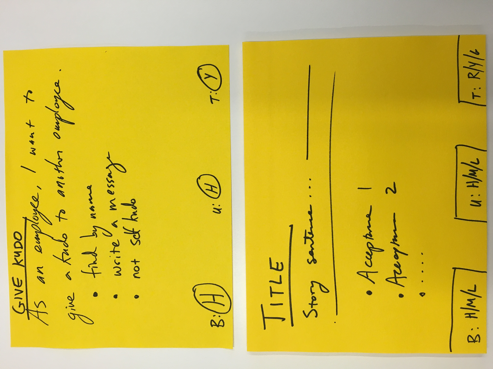

# Backlog Board

## Product Backlog (Stories)

The story card (see template below) includes:
* ID: Matches ID from user provided backlog
* Title: short name
* Story sentence: in the form of "As a XXXX I want to YYYYY"
* Acceptance criteria summary bullets
* Scores
  - (B)usiness value: High/Medium/Low 
  - (U)ser value: High/Medium/Low
  - (T)echnical feasibility: 
    * Red: Cannot be built within the challenge timeframe
    * Yellow: Only this could be built within the challenge timeframe
    * Green: This and other features can be built within the challenge timeframe

## Sprint Backlog (Tasks)

Sample Template Tasks:
1. Write Test Case
2. Execute Test Case
3. Develop Low-fi mock-up/wire frame
4. Develop API
5. Develop UI
6. Integrate API and UI
7. Develop Hi-fi design
