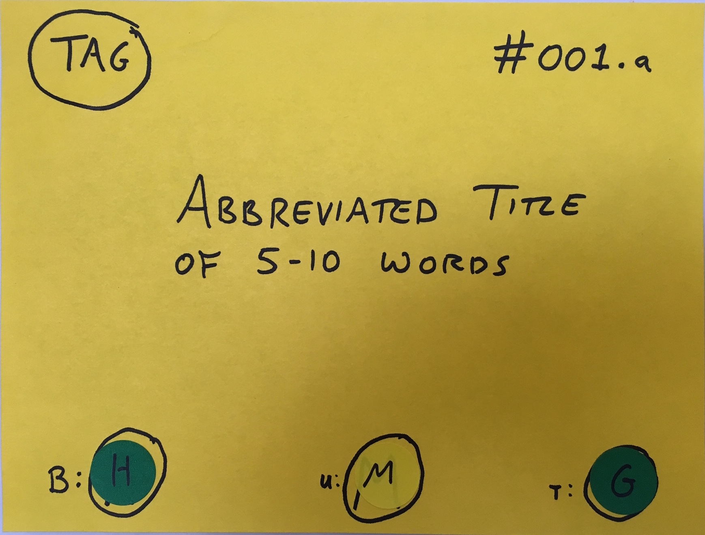

# Backlog Board

## Product Backlog (Stories)

The story card (see template below) includes:
* Tag: If appropriate, tag as:
  - BR: Business rule
  - Data: Data requirement
  - NFR: Nonfunctional requirement 
* ID: Matches ID from PO-provided backlog (create IDs if not existing)
* Title: abbreviated (5-10 words) title, readable from a distance
* Scores
  - (B)usiness value: [H]igh/[M]edium/[L]ow 
  - (U)ser need: [H]igh/[M]edium/[L]ow 
  - (T)echnical feasibility: R/Y/G
    * [R]ed: Cannot be built within the challenge timeframe
    * [Y]ellow: Only this could be built within the challenge timeframe
    * [G]reen: This and other features can be built within the challenge timeframe

## Sprint Backlog (Tasks)

Sample Template Tasks:  
1. Write Test Case  
2. Execute Test Case  
3. Develop Low-fi mock-up/wire frame  
4. Develop API  
5. Develop UI  
6. Integrate API and UI  
7. Develop Hi-fi design  
